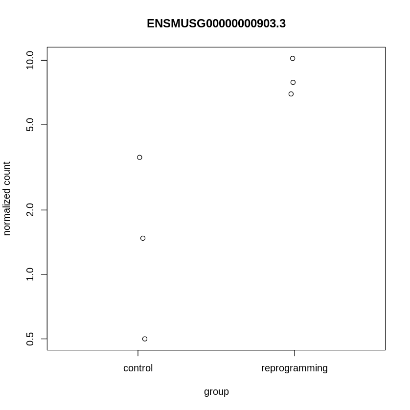
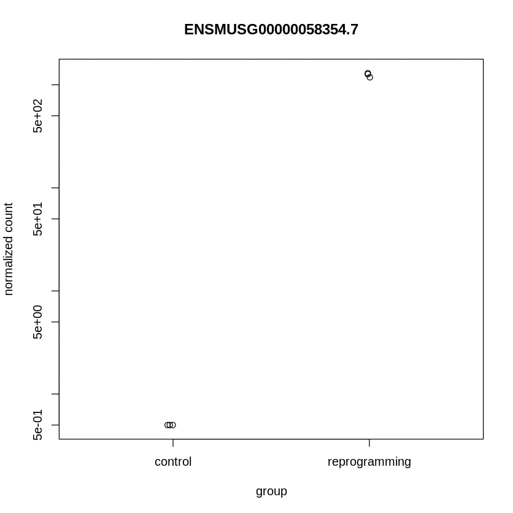
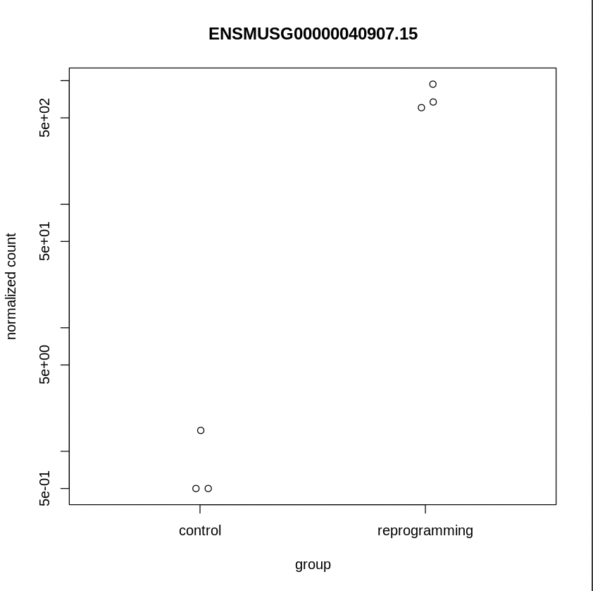
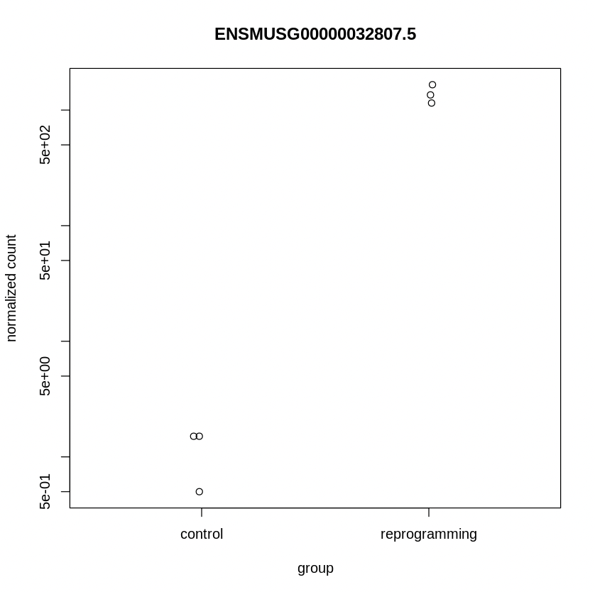
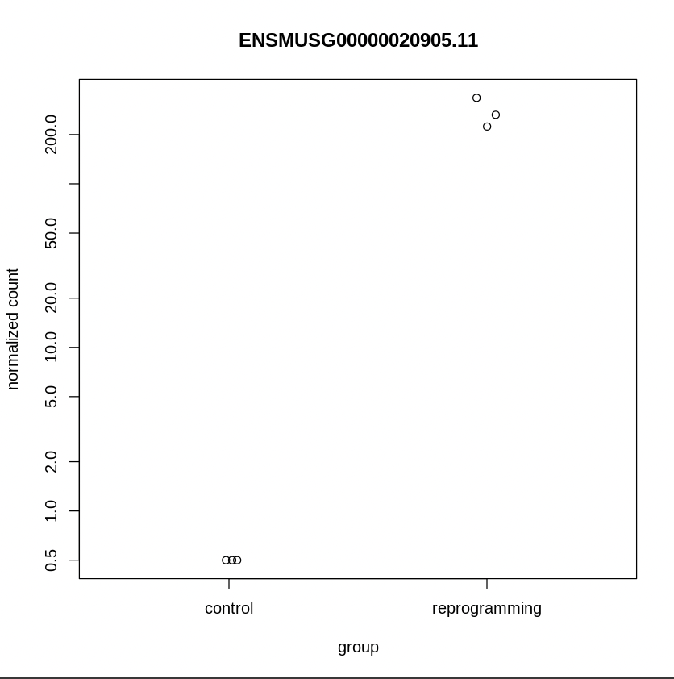

# hse21_hw3
## Ссылки на GoogleColab
### Python
### https://colab.research.google.com/drive/1ZAOdRGiXZDXl9OKRY_0zndGnGppEFSLf?usp=sharing
### R
### https://colab.research.google.com/drive/19lxcm96Tu_0xX_7NmTO5X3Z3PpmZGcIa?usp=sharing

# Статистика MultiQC 

# Статистика по каждому из 6-ти образцов

# Результаты DESeq
## MA plot

## Pheat map 

## 

